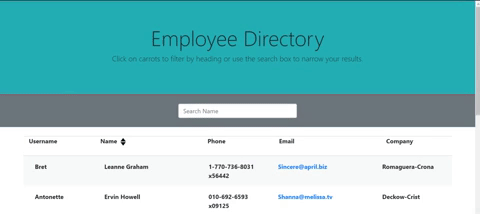
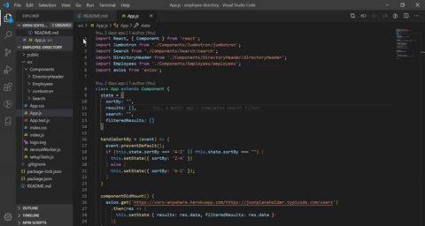

## Employee Directory

This project was bootstrapped with [Create React App](https://github.com/facebook/create-react-app).

This app is ideal for the employer who needs routine access to employee information.  The site uses a rest server to access a local database to store employee information.  The retrieved list allows the user to sort and/or search by employee name.  

  

## User Story

As a user, I want to be able to view my entire employee directory at once so that I have quick access to their information.

## Business Context
An employee or manager would benefit greatly from being able to view non-sensitive data about other employees. It would be particularly helpful to be able to filter employees by name.

## Technology
This app uses Create-React-App along with the Axios library to create the user experience.

## Installation
1. Download repository or use git clone from the CLI to clone the remote repository
1. Run the npm install from the root directory
1. Change the project to use your own employee listing
   1. use git to save versions
   1. push your own commit to your repository

## A view of the completed App.js file

### Explore App

Open [https://polar-eyrie-76278.herokuapp.com/](https://polar-eyrie-76278.herokuapp.com/) to view it in the browser.
